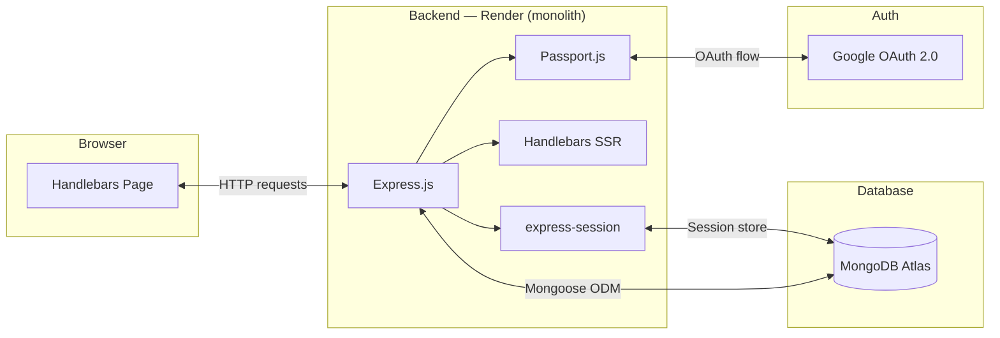

# 📖 Music Stories

A full-stack web application for creating and sharing music stories. Users log in with Google, then can write, edit, and delete their own stories — and browse public stories from other users.

> **Live demo:** [music-stories-4uvz.onrender.com](https://music-stories-4uvz.onrender.com)

> ⚠️ Hosted on Render free tier — first load may take 30–60 seconds while the server wakes up.

---

## ✨ Features

- Google OAuth 2.0 login
- Create, edit and delete your own stories
- Public / private story visibility
- Browse public stories from all users
- Route protection — dashboard requires authentication
- Session persistence backed by MongoDB
- Rich text editing with CKEditor

---

## 🛠️ Tech Stack

| Layer          | Technology                      |
| -------------- | ------------------------------- |
| Runtime        | Node.js                         |
| Framework      | Express.js                      |
| Templating     | Handlebars (SSR)                |
| Database       | MongoDB Atlas + Mongoose        |
| Authentication | Passport.js + Google OAuth 2.0  |
| Sessions       | express-session + connect-mongo |
| Rich text      | CKEditor                        |
| Deployment     | Render                          |

---

## 🏗️ Architecture



---

## 🚀 Running Locally

To run this project locally you will need accounts and credentials for two external services: **MongoDB Atlas** and **Google Cloud Console**. Steps 1–2 below walk you through each one.

### 1. MongoDB Atlas

1. Create a free account at [cloud.mongodb.com](https://cloud.mongodb.com)
2. Create a new **free cluster** (M0)
3. Under **Database Access** add a user with read/write permissions
4. Under **Network Access** add `0.0.0.0/0` to allow connections from anywhere
5. Click **Connect → Drivers → Node.js** and copy the connection string:
   ```
   mongodb+srv://<username>:<password>@<cluster>.mongodb.net/musicstories?retryWrites=true&w=majority
   ```

> ⚠️ **Windows / Node.js v18+ note:** If you get a `querySrv ECONNREFUSED` error, the `+srv` DNS lookup is failing on your machine. Use the direct connection string instead — find it in Atlas under **Connect → Shell**, then copy the hostname list. It looks like:
>
> ```
> mongodb://<username>:<password>@cluster0-shard-00-00.<cluster>.mongodb.net:27017,cluster0-shard-00-01.<cluster>.mongodb.net:27017,cluster0-shard-00-02.<cluster>.mongodb.net:27017/musicstories?authSource=admin&retryWrites=true&w=majority&tls=true
> ```
>
> See `.env.example` — the direct string is included there as a commented-out alternative.

### 2. Google OAuth 2.0

1. Go to [console.cloud.google.com](https://console.cloud.google.com) and create a new project
2. Go to **APIs & Services → OAuth consent screen**
   - Choose **External**, fill in app name and your email
   - Under **Test users** add your Gmail address
3. Go to **APIs & Services → Credentials → Create Credentials → OAuth 2.0 Client ID**
   - Application type: **Web application**
   - Authorized redirect URIs: `http://localhost:5000/auth/google/callback`
4. Copy the **Client ID** and **Client Secret**

### 3. Clone & configure

```bash
git clone https://github.com/shopatomek/music-stories.git
cd music-stories
npm install
cp .env.example .env
```

Fill in `.env` with your credentials (see `.env.example` for details on each value).

### 4. Run

```bash
npm run dev
```

Open [http://localhost:5000](http://localhost:5000) in your browser.

---

## 🔒 Environment Variables Reference

| Variable               | Where to find it                                                                     |
| ---------------------- | ------------------------------------------------------------------------------------ |
| `MONGO_URL`            | MongoDB Atlas → Connect → Drivers → Node.js                                          |
| `SESSION_SECRET`       | Generate: `node -e "console.log(require('crypto').randomBytes(32).toString('hex'))"` |
| `GOOGLE_CLIENT_ID`     | Google Cloud Console → APIs & Services → Credentials → OAuth 2.0 Client              |
| `GOOGLE_CLIENT_SECRET` | Same as above                                                                        |
| `GOOGLE_CALLBACK_URL`  | `http://localhost:5000/auth/google/callback` for local                               |
| `NODE_ENV`             | `development` locally, `production` on Render                                        |

---

## ☁️ Deployment on Render

This app deploys as a **monolith** on [Render](https://render.com). Because it uses server-side rendering and session management it requires a persistent server — Vercel is not suitable for this architecture.

### Steps

1. Push your code to GitHub
2. Go to [render.com](https://render.com) → **New → Web Service** → connect your repo
3. Configure:

| Field         | Value         |
| ------------- | ------------- |
| Build Command | `npm install` |
| Start Command | `node index`  |
| Instance Type | Free          |

4. Add all variables from `.env.example` in the **Environment** tab, using production values:
   - `MONGO_URL` → your Atlas connection string with `/musicstories`
   - `CORS_ORIGIN` → your Render URL
   - `GOOGLE_CALLBACK_URL` → `https://your-app.onrender.com/auth/google/callback`
   - `NODE_ENV` → `production`

5. In Google Cloud Console → your OAuth client → add to **Authorized redirect URIs**:

   ```
   https://your-app.onrender.com/auth/google/callback
   ```

6. Click **Deploy**

---

## 📁 Project Structure

```
music-stories/
├── config/
│   └── passport.js         # Google OAuth strategy
├── middleware/
│   └── auth.js             # ensureAuth / ensureGuest route guards
├── models/
│   ├── story.js            # Story schema
│   └── user.js             # User schema (from Google profile)
├── routes/
│   ├── auth.js             # /auth/google, /auth/logout
│   ├── index.js            # / (login page), /dashboard
│   └── stories.js          # CRUD: /stories
├── views/                  # Handlebars templates
│   ├── layouts/
│   ├── partials/
│   └── stories/
├── public/css/             # Stylesheet
├── helpers/hbs.js          # Custom Handlebars helpers
└── index.js                # App entry point
```

---

## 👤 Author

**Tomasz Szopa**
&nbsp;·&nbsp; [shopa.tomek@gmail.com](mailto:shopa.tomek@gmail.com)
&nbsp;·&nbsp; [GitHub](https://github.com/shopatomek)

[](https://github.com/shopatomek/music-stories/blob/main/LICENSE)
